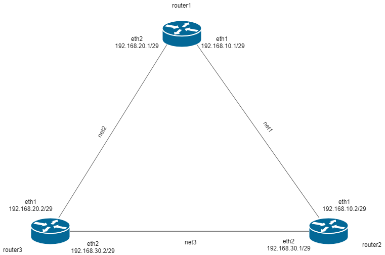

# Домашнее задание
 OSPF
- Поднять три виртуалки
- Объединить их разными private network
1. Поднять OSPF между машинами на базе Quagga
2. Изобразить ассиметричный роутинг
3. Сделать один из линков "дорогим", но что бы при этом роутинг был симметричным

Формат сдачи:
Vagrantfile + ansible 

# Выполнение
1. Развернуты вирталки и настроен OSPF согласно схемы.

2. Для настройки асимметричного маршрута необходимо выполнить плейбук `asymmetric.yml`.

Для проверки включаем tcpdump на интерфейсах 1 и 2 роутера. пингуем адрес 10.10.20.1
видим что ICMP echo request уходит с интерфейса 2
* listening on eth2, link-type EN10MB (Ethernet), capture size 262144 bytes
* 08:02:25.411999 IP router1 > 10.10.20.1: ICMP echo request, id 7830, seq 1, length 64
* 08:02:26.412234 IP router1 > 10.10.20.1: ICMP echo request, id 7830, seq 2, length 64

А ICMP echo reply приходят на интерфейс 1
* listening on eth1, link-type EN10MB (Ethernet), capture size 262144 bytes
* 07:57:13.333323 IP 10.10.20.1 > router1: ICMP echo reply, id 7779, seq 15, length 64
* 07:57:14.334131 IP 10.10.20.1 > router1: ICMP echo reply, id 7779, seq 16, length 64

3. Для настройки симметричного маршрута необходимо выполнить плейбук `symmetric.yml`

Для проверки включаем tcpdump на интерфейсах 1 и 2 роутера. пингуем адрес 10.10.20.1
видим что ICMP echo request уходит с интерфейса 2 и ICMP echo reply приходят туда же.
* listening on eth2, link-type EN10MB (Ethernet), capture size 262144 bytes
* 08:14:21.722389 IP router1 > 10.10.20.1: ICMP echo request, id 7830, seq 715, length 64
* 08:14:21.725538 IP 10.10.20.1 > router1: ICMP echo reply, id 7830, seq 715, length 64
