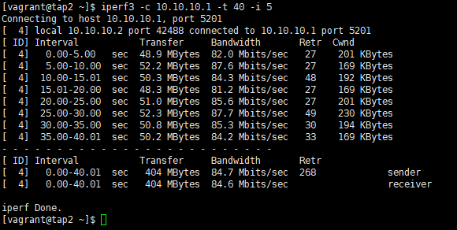
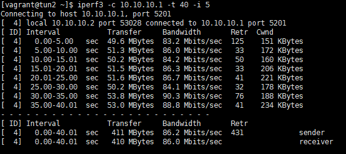

# Домашнее задание
VPN
1. Между двумя виртуалками поднять vpn в режимах
- tun
- tap
Прочуствовать разницу.

2. Поднять RAS на базе OpenVPN с клиентскими сертификатами, подключиться с локальной машины на виртуалку

3*. Самостоятельно изучить, поднять ocserv и подключиться с хоста к виртуалке 

---
TAP эмулирует Ethernet устройство и работает на канальном уровне модели OSI, оперируя кадрами Ethernet. TUN (сетевой туннель) работает на сетевом уровне модели OSI, оперируя IP пакетами. TAP используется для создания сетевого моста, тогда как TUN для маршрутизации. 

