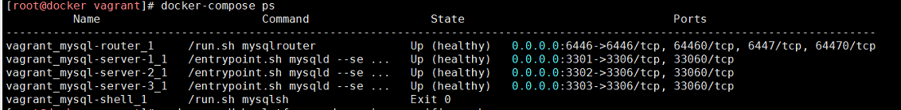
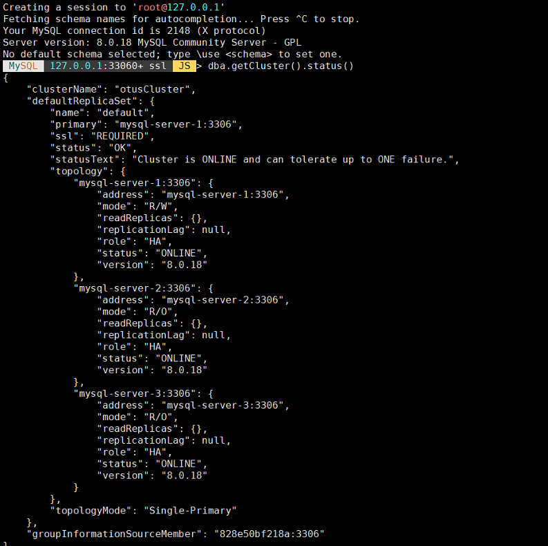

# Домашнее задание
mysql cluster
развернуть InnoDB кластер в docker
* в docker swarm

в качестве ДЗ принимает репозиторий с docker-compose
который по кнопке разворачивает кластер и выдает порт наружу

# Проверка

Проверяем состояние контейнеров и номера открытых портов:

Проверяем состояние кластера:

